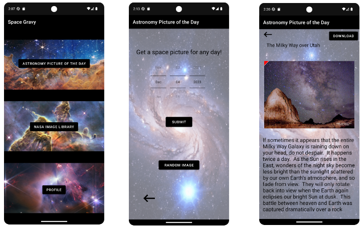

# Space Gravy

GW 2023 project for CSCI4237 - Software Development for Handheld Devices by Damien Villegas

## Description

*Space Gravy* is a space image app using [NASA API](https://api.nasa.gov/) and [Firebase](https://firebase.google.com/?gad_source=1&gclid=EAIaIQobChMI89Sx7viFgwMVTvnICh2NsQxoEAAYASAAEgLH9_D_BwE&gclsrc=aw.ds) Users can look at the astronomy pictures of the day (APOD), search terms using the NASA image library, and save images to their profile. It's the perfect app for looking at space and marveling at its beauty.

To run this app you will need a (free) API key and (free) Firebase project. I've provided a tutorial to show how to set up Space Gravy locally and where to put the API keys.

## Features

- User accounts with authorization and login capabilities
- Save login info using data persistence
- APOD: View the NASA space image for any day and read the associated description. Note that the earliest date you can put is June 16th, 1995, as that is the first-ever APOD image, and the latest date is whatever your current date is
- APOD: Click the image to bring up the URL to view in full screen or download the image to your phone
- NASA Image Library: Enter space search term(s) to view relevant images
- NASA Image Library: Save the images to your phone or your profile
- Profile: View saved images and account information. Ability to remove saved images from your profile

## Showcase

## Tutorial 

### Step 1

### Step 2

### Step 3

